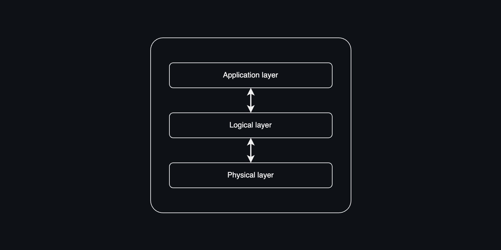
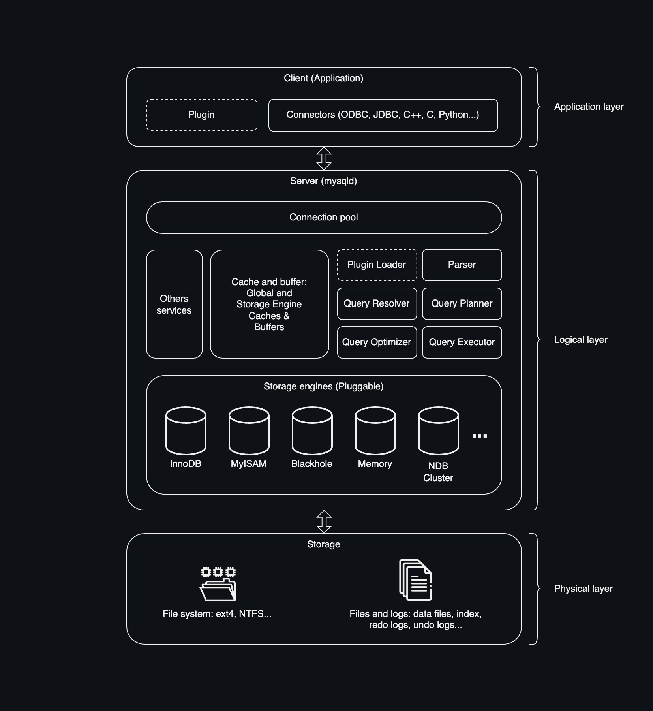
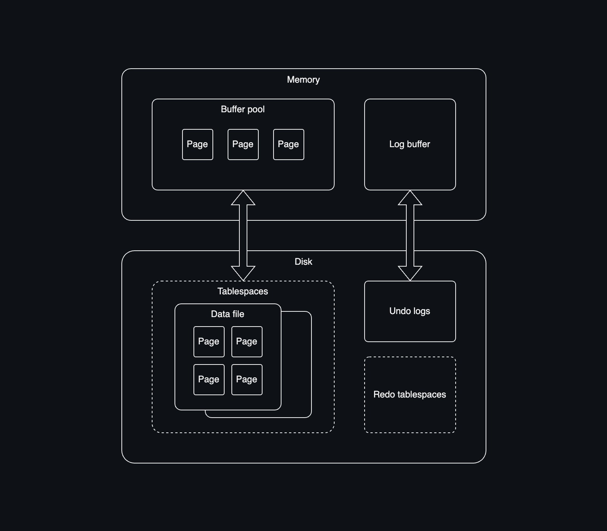
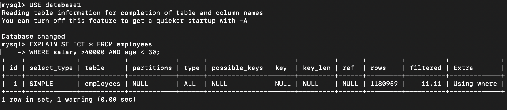

# Understanding Your Queries

I worked as an unofficial, part-time MySQL database administrator (self-claimed) for one years and earned my MySQL 8.0 Administrator certification in 2023. My official position at the company was as an ETL developer, but I had the opportunity to assist the DBA team with MySQL database optimization on a casual basis. At that time, I have already learning database administration for three years.

Later, I decided to take a break and go abroad to pursue a master’s degree, so I haven't had the chance to work with MySQL since. I'm not sure if I'll work with MySQL again in the future, but it would be a shame to forget everything I've spent so much time learning. Creating these notes not only helps me reinforce what I've learned, but my main goal is to support those new to database administration by providing a solid foundation of how query work and how to optimize them in MySQL.

### Important note
The way all relational databases handle queries is fundamentally the same across current products on the market. In this repository, I use MySQL as an example, but you can apply this knowledge to any database you work with.

### Brief introduction of Mysql

MySQL is an open-source relational database management system (RDBMS) that uses SQL to manage data. It’s known for being fast, reliable, and widely used in web applications. MySQL supports multiple storage engines, with InnoDB being the default. It’s free, scalable, and maintained by Oracle with a large developer community.

## Overview

In this repository, you will learn:

1. **MySQL Architecture**
- MySQL architecture
- Storage engines architecture
- Directory structure of the MySQL server

2. **Query Optimization**
- Misconceptions
- The execution plan
- Best practices for indexing


## 1. Database Architecture
Before diving into the query optimization section, it’s important to understand the architecture of the database system. 

Most databse follow a structure similar to a three-tier architecture, which can be simplified as shown in this illustration.


The architecture consists of three layers:
- Client (Applications layer)
- Server (Logical layer)
- Storage (Physical layer)

For example, this is the architecture of MySQL:




## Client Layer
The client, or application layer, is straightforward to understand. It represents any application used to connect to and interact with the database server. This can be a web application, an SQL GUI, SQL CLI, Azure Studio, MySQL Workbench and more. In fact, you can’t directly interact with database without a client. For example, when you open a terminal and type ```mysql```, you’re using a query interface, which is also a type of client.

Here is an example of connecting to MySQL server using ```mysql```

```zsh
(base) an@Ans-MacBook-Pro ~ % mysql -u root -p
Enter password: 
Welcome to the MySQL monitor.  Commands end with ; or \g.
Your MySQL connection id is 9
Server version: 8.1.0 MySQL Community Server - GPL

Copyright (c) 2000, 2018, Oracle and/or its affiliates. All rights reserved.

Oracle is a registered trademark of Oracle Corporation and/or its
affiliates. Other names may be trademarks of their respective
owners.

Type 'help;' or '\h' for help. Type '\c' to clear the current input statement.

mysql> 
```

The client connects to the server through ```connectors```, or you can also call them APIs. There are various connectors available, such as JDBC, ODBC, C++, C, and Python, depending on the application you’re using.

## Server Layer
The server layer consists of many components, but we can simplify it into two sub-layers: the service layer and the storage layer.

The service layer includes everything above the storage engine in the architecture. There are two main components to focus on here: the cache and buffer area, and the query processing components.

**Query Processing Components**: These include the parser, query resolver, query planner, query optimizer, and query executor. These components may have different names in different DBMS, but they all serve a same purpose.

- Parser: When a query is received, the parser breaks it down into small tokens and checks the syntax.
- Query Resolver: This component checks the user’s privileges on the schema, table, and database.
- Query Planner: The planner generates an initial plan for executing the query, typically based on table structure and available indexes.
- Query Optimizer: The optimizer refines the initial query plan to find the most efficient execution path.
- Query Executor: Finally, the executor executes the optimized query plan, retrieves the data, and returns the results to the cache and buffer.

**Cache and Buffer**: This section holds all information related to the session, including queries, changes, and the storage engine’s cache and buffer. So if you run a query twice, the second time will run faster since all data is already stored here.

### Storage engine

The storage engine is responsible for interacting with the underlying data at the physical server level. Its job is to manage data files, table spaces and logs.

One unique feature of MySQL, compared to other databases, is its modular storage engine architecture. MySQL developers refer to this as its **"pluggable storage engines"**. This modularity offers significant benefits, especially for specific applications, such as data warehousing, transaction processing, or high-availability situations. It allows users to take advantage of a set of interfaces and services that remain independent of any single storage engine.

Storage engine in-memory architecture:



The graph above shows a simplified version of the storage engine architecture. I’ve simplified it to emphasize one key point: the page is the smallest data unit that a storage engine works with. This concept is similar across many database systems. For example, in Oracle, these units are called blocks, while in MySQL and MS SQL, they’re called pages.

When discussing how a database searches for data in storage, it’s important to note that **database doesn’t search for rows directly—it searches for pages, which contains data rows.**

These pages are stored inside a tablespace. What is a tablespace? It’s exactly what the name suggests: a space for a table. This is a logical concept. By default, each table has its own tablespace, and in MySQL, you can find these in your hardware storage as .ibd files (InnoDB data files).

```
(base) an@Ans-MacBook-Pro ~ % cd /usr/local/mysql/data
(base) an@Ans-MacBook-Pro data % ls
#ib_16384_0.dblwr       mysql.ibd
#ib_16384_1.dblwr       mysqld.local.err
#innodb_redo            performance_schema
#innodb_temp            bprivate_key.pem
Database1               public_key.pem
Database2               server-cert.pem
Practice                server-key.pem
ib_buffer_pool          sys
ibdata1                 undo_001
ibtmp1                  undo_002
mysql
(base) an@Ans-MacBook-Pro data % cd Database1
(base) an@Ans-MacBook-Pro Database1 % ls
employees.ibd		youtube.ibd
```

Inside each tablespace, there are pages. By default:
- Each page is 8 KB (the same for every other database system).
- A .idb data file containing one page is 115 KB in size.

To summarize:
- A tablespace is a logical structure used by databases to manage data.
- A tablespace can contain many data files.
- Each data file consists of pages.
- A data file can contain data of multiple tables, but by default of MYSQL, each tablespace has one data file, and that data file contains the data for only one table.

### Important Note  
You may wonder why understanding architecture is important for query optimization?  

For query processing components, in 99% of cases, you only need to know that they exist and help execute your query. There’s not much you can do to interfere with them. However, one key thing to remember is that the database does not understand queries the same way we do.  

For example, these two queries:  

```sql
SELECT * FROM employees WHERE salary >20000;
```
and
```sql
SELECT * FROM employees 
WHERE salary >20000;
```
will be understood as different queries by the database. Although they are exactly the same, the parser interprets them differently, leading to two different queries being stored in the cache.

Despite this, these queries still share the same ```Execution Plan``` (which we will discuss in the next section). This means the data in the cache for the two queries are one; and whatever version of above query run first will help the other one run faster nextime. For some versions of database, for example MySQL 8.0, query_cache was removed, so I guess it is not much of the deal.

The next thing to pay attention to is the cache and buffer, as they directly affect your database performance. You can configure the size and other attributes of the cache and buffer in the configuration file.

The most important component in the server layer is the storage engine. The key focus should be on how the storage engine searches for data on the disk, how data is read and written and how it interact with the buffer pool.

## 2. Query Optimization  

### Misconceptions
Before diving into this section, I want to address some common misconceptions about query optimization:
1. **Adding `WHERE` conditions or `LIMIT` makes queries faster because they return less data.**  
2. **Creating indexes always improves query performance.**  

Both of these assumptions are false. While these methods can sometimes make your query run faster, it’s often just coincidental.  

By exploring these misconceptions, we will deepen our understanding of how queries actually work.  


#### Understanding Query Execution  

We’ve already covered how storage engines store data in the Architecture section. Now, let’s go deeper to truly understand what happens when you retrieve data from a database.  

When you run a query, you might expect the server to search through the data files stored on disk for the relevant rows and load them into memory. However, that’s not how it works.  

Remember, data is stored in **pages**—the smallest unit of database I/O. When you run a query, the database doesn’t retrieve individual rows; instead, it loads the **entire page** containing the data into memory. From there, the storage engine filters the relevant rows.  
 
In practice, even if you’re retrieving only a few rows, the execution time can still be very long. This often happens when your data is **spread across many pages**. The storage engine needs to scan all these pages and load the relevant ones into memory, which increases the runtime. 

---

#### Example
For example, consider this query:
```sql
SELECT * FROM employees 
WHERE salary >40000 AND age < 30;
```

Let’s assume the ```employees``` table has 10,000 data pages.

**This is how the Storage Engine Processes This Query**

1. Scanning Data Pages:
The engine will scan all of the ```employees``` table’s data pages to identify the pages containing valid rows.

2. Scenario 1: Valid data is concentrated in 1,000 pages.
In this case, the query will run faster because only 1,000 pages need to be loaded into memory, reducing the I/O operations.

3. Scenario 2: Valid data is spread across all 10,000 pages.
Here, the query won’t benefit from the ```WHERE``` condition since the engine still needs to load all 10,000 pages to identify the relevant data.

**Will This Query Run Faster Without the WHERE Clause?**

Surprisingly, yes—removing the WHERE clause can make the query run faster in certain scenarios.

Here’s why: Without the WHERE clause, the engine directly loads all the pages related to the table into memory. In contrast, when you include the WHERE clause, the engine must first evaluate and filter rows during the initial page scan, adding an extra processing step. This additional filtering increases the query runtime.

```
19:20:28	SELECT * FROM employees  WHERE salary >40000 AND age < 30	315729 row(s) returned	0.0027 sec / 0.288 sec

19:20:45	SELECT * FROM employees	1185550 row(s) returned	0.0010 sec / 0.342 sec
```

Notice how it takes less than half the time to return a million rows compared to just 315,729 rows. **Less data returned does not always mean a faster query.**

Similar to using `LIMIT`, here's an example:  

This query:
``` sql
SELECT * FROM employees 
WHERE age < 30 ORDER BY age DESC LIMIT 200;
```
Takes more time to run compared to this query:

``` sql
SELECT * FROM employees 
WHERE age < 30;
```
```
19:34:25	SELECT * FROM employees  WHERE age < 30 ORDER BY age DESC LIMIT 200	200 row(s) returned	0.259 sec / 0.000073 sec

19:34:33	SELECT * FROM employees  WHERE age < 30	394772 row(s) returned	0.0021 sec / 0.259 sec
```
Notice how it takes significantly more time to return a much smaller number of records?

The difference lies in the ```ORDER BY``` clause. When the query includes ORDER BY, the database must:

1. Retrieve all the relevant data from the employees table.
2. Sort the data in descending order.
3. Finally, filter out the unnecessary rows to satisfy the ```LIMIT``` condition.

These two additional steps—sorting and filtering—make the query with ```ORDER BY``` and ```LIMIT``` take longer, despite returning fewer rows. Even though the result set is smaller, both queries use the same number of data pages stored in cache. The extra processing steps in the first query result in a longer runtime.

### Execution Plan
So what is behind all of this
Remember we have things called query planner and query optimizer?. Their job is to tell the storage engine the best way to retrieve data. and what consider the best? The answer is that it will chose the option with **minimal** I/O. Well, there are indeed many criteria and parameter that database uses to assesss the best plan, but I/O is the most important thing. These parameters, combine to gether and database will give out a thing call 'cost'. the lowest cost execution plan will be chose.
By using ```EXPLAIN``` we can see the execution plan of each query




Useful links
- https://www.sqlservercentral.com/articles/understanding-the-internals-of-a-data-page
- https://www.alibabacloud.com/blog/mysql-memory-allocation-and-management-part-ii_600992